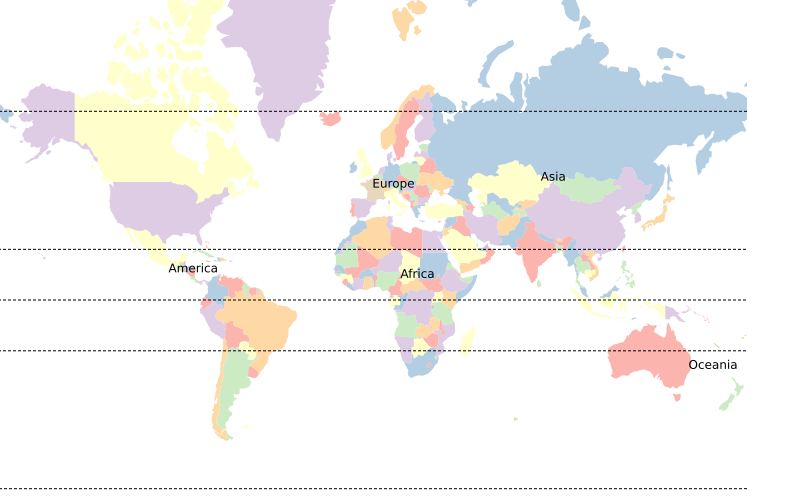

#Draw a map for print

*Drawing maps for print with javascript? Is the point of javascript not to do things for the web?*

Yes, of course. And we will get there in coming chapters. Whether you need a quick map to illustrate an article or a more complex one for a printed poster, you can do it with javascript without the use of any desktop GIS software. That is what this chapter is about. It will also get us to start playing with [D3js](http://d3js.org/) by [Mike Bostock](http://bost.ocks.org/mike/)

##D3js

D3 stands for Data Driven Documents. It lets you manipulate [SVG](https://en.wikipedia.org/wiki/SVG), in a similar way to how you may use [jQuery](http://jquery.com/) to manipulate the [DOM](https://en.wikipedia.org/wiki/Document_Object_Model), using data. If the last sentence makes no sense to you, don't worry. It just means that you can draw vector graphics (SVG) using data with this library.

###A quick example

For this chapter we create a new folder called ```chapter_2_print_map```.

It is not the aim of this tutorial to show in detail how D3 works. The [documentation](https://github.com/mbostock/d3/wiki/API-Reference) is really good, there are plenty of tutorials out there and if you are like me and prefer good old paper books, I recommend the excellent [Interactive Data Visualization for the Web by Scott Murray](http://chimera.labs.oreilly.com/books/1230000000345/index.html). 

For a quick example to give you an idea, create a file called ```d3_example.html```, open it in a text editor and create a basic html file.

```
<!DOCTYPE html>
<html>
	<head>
		<script src="https://cdnjs.cloudflare.com/ajax/libs/d3/3.5.6/d3.min.js" charset="utf-8"></script>
	</head>
	<body>
		<script>

		</script>
	</body>
</html>
```

The first ```<script>``` tag loads the D3 library. We will write our script in the second.

First select the body of the document

```
var body = d3.select('body')
```

And add an ```<svg>``` tag to it (with height and weight attributes).

```
var svg = body.append('svg').attr({
		height: 300,
		width: 500	
	})
```

If you open ```d3_example.html``` in a browser and inspect the ouput (```ctrl + shift + C``` in Firefox), you will see that an svg tag has been added to the body

```
<svg width="500" height="300"></svg>
```

Go back to your script and draw a blue rectangle, 10 pixels from the left and 20 pixels from the top of the top-left corner. It will be 200 pixels wide and 50 pixels high. 

```
var blueRectangle = svg.append('rect')
	.attr({
		fill: 'blue',
		x: 10,
		y: 20,
		width: 200,
		height: 50
	})
```

Refresh the browser and see the rectangle. 

Now we will make a horizontal bar graph with some random data. Remove the code for the blue rectangle, create an empty array called ```randomData``` and populate it with five random integers between 0 and 500.

```
var randomData = []
for(i=0;i<5;i++) {
	randomData.push(Math.floor(Math.random() * 500))
}
```

```Math.random()``` creates a random number between 0 and 1 so we multiply it by 500. ```Math.floor()``` rounds it to the lower integer.

Draw a rectangle for each one these random numbers.

```
svg.selectAll('rect')
	.data(randomData)
	.enter()
	.append('rect')
```

If you inspect the document with the browser you see that five ```<rect></rect>``` tags have been added to the body. But you can not see them because they know neither where they are suppose to be, nor how big they are or of which colour they ought to be.

If you remember our blue rectangle from above, you see that there are no attributes (x,y,width,height,fill). We will add them using the random data. Modify your code like this

```
svg.selectAll('rect')
	.data(randomData)
	.enter()
	.append('rect')
	.attr({
		x: 10,
		y: function(d,i) { return i * 30 },
		width: function(d) { return d },
		height: 30,
		fill: 'blue' 
	})
```

All of our rectangles start 10 pixels from the left, ```x``` is always 10. We want our rectangles to start every 30 pixels from the top so we multiply the index ```i``` of each of them by 30 for our attribute ```y```. They will all be of different width depending on the data in the array. As we took random integers between 0 and 500 (the maximum corresponds to the width of our svg), we say that each rectangle will be that integer in ```width```. The ```height``` will be 28 so that we have 2 pixels space between them. Finally all of them will be blue.

Refresh the browser. This is your first graph with D3. Hopefully there will be many more.

The code is [here](https://github.com/idris-maps/gis-with-javascript-tutorial/blob/master/chapter_2_print_map/d3_example.html)

###Learning d3

This basic example shows how straight forward the api is. The trick is that you must have a good understanding of how svg works. D3js has so many helpful functions that it may seem daunting at first. You do not need to learn them all to start creating visualisations. Once you understand how it works, you can do pretty much anything. Check out the [examples](https://github.com/mbostock/d3/wiki/Gallery) for some inspiration.

Luckily, to make maps we only need to understand a few essential parts of the library.

###Maps with D3

Apart from ```<rect>```, there are a few basic shapes you can do in svg such as lines ```<line>``` or circles ```<circle>```. More complex shapes are represented as paths ```<path>```. Each path has an attribute ```d``` that describes how it looks. D3 helps us create paths from a GeoJSON by calculating the ```d``` attributes depending on the projection we choose. We will start by using the ```countries.json``` file from [the first chapter](https://github.com/idris-maps/gis-with-javascript-tutorial/tree/master/chapter_1_geodata). Get it [here](https://github.com/idris-maps/gis-with-javascript-tutorial/blob/master/chapter_2_print_map/data/countries.json)  

##Setup

Create a directory ```chapter_2_print_map``` and another one within it called ```data``` where you put the ```countries.json``` file.

If you do not have ```browserify``` and ```watchify``` install them globally using npm.

```
$ sudo npm install browserify -g
$ sudo npm install watchify -g
```

```browserify``` lets you require libraries as in nodeJS while writing script for browsers. ```watchify``` does the same but watches for changes in any of your dependencies (the files you have required) and updates the browser script automatically. So you do not need to run ```browserify``` after every modification.

Create a folder ```public``` in ```chapter_2_print_map``` and create an ```index.html``` file like this

```
<!DOCTYPE html>
<html>
    <head>
			<meta charset="utf-8">
		</head>
    <body>
        <script src="script.js"></script>
    </body>
</html>
```

Go back to ```chapter_2_print_map``` and create a file ```main.js```

```
console.log('hello from main.js')
```

If you run ```watchify``` in the console

```
$ watchify main.js -o public/script.js
```

You will see that a ```script.js``` file has been created in the ```public``` folder. Open ```index.html``` in a browser and check the console (```ctrl + shift + K``` in Firefox). If you see the message, everything you will write in ```main.js``` will be sent to ```script.js``` as long as ```watchify``` is running.

Initialise npm and download d3

```
$ npm init
$ npm install d3 --save
```

###Draw polygons

Open ```main.js```, remove the log message and require ```d3``` and ```countries.json```

```
var d3 = require('d3')
var countriesData = require('./data/countries.json')
```

Grab the body and append an ```<svg>``` element, 800 in width and 500 in height

```
var body = d3.select('body')
var svg = body.append('svg')
	.attr({
		width: 800,
		height: 500
	})
```

Create a ```projection``` (I choose mercator but there are [many possibilities](https://github.com/mbostock/d3/wiki/Geo-Projections)) and a path creator to which you give the ```projection```.

```
var projection = d3.geo.mercator()
var pathCreator = d3.geo.path().projection(projection)
```

Create a ```<path>``` element in ```<svg>``` for each feature by passing the data to D3. As we will create several layers, some of them being paths as well, we give these a ```class``` attribue of ```countries```

```
svg.selectAll('path.countries')
	.data(countriesData.features)
	.enter()
	.append('path')
	.attr({
		class: 'countries'
	})
```

Add an attribute ```d``` and give it the ```pathCreator``` as value

```
svg.selectAll('path.countries')
	.data(countriesData.features)
	.enter()
	.append('path')
	.attr({
		class: 'countries',
		d: pathCreator // <-- new
	})
```

Open ```index.html``` in the browser. You have a world map. Well the whole world does not fit but we have a map. You can add ```scale``` and ```translate``` to the projection. By playing around with it, I found that scale 150 and translate [370,300] suited my purposes. Change your projection like this


```
var projection = d3.geo.mercator().scale(120).translate([370,300])
```

We want to add some color. Luckily the features in ```countries.json``` have a property called ```mapcolor7``` that divide the countries in 7 different colors. 

We need to create a function that returns one of 7 colors if fed with a number between 1 and 7. I took the colors from [colorbrewer](http://colorbrewer2.org/)

```
function color(nb) {
	if(nb === 1) { return '#fbb4ae' }
	if(nb === 2) { return '#b3cde3' }
	if(nb === 3) { return '#ccebc5' }
	if(nb === 4) { return '#decbe4' }
	if(nb === 5) { return '#fed9a6' }
	if(nb === 6) { return '#ffffcc' }
	if(nb === 7) { return '#e5d8bd' }
}
``` 

Add a ```fill``` attribute to the paths that gets the ```mapcolor7``` property and apply the ```color``` function

```
svg.selectAll('path.countries')
	.data(countriesData.features)
	.enter()
	.append('path')
	.attr({
		class: 'countries',
		d: pathCreator,
		fill: function(d) { return color(d.properties.mapcolor7) } // <-- new
	})
```

Check it in the browser

###Draw lines

I downloaded ["Geographic lines" from natural earth](http://www.naturalearthdata.com/http//www.naturalearthdata.com/download/110m/physical/ne_110m_geographic_lines.zip) (these are the equator, the polar circles and the tropics), converted it to GeoJSON and called it ```lines.json```. Get it [here](https://github.com/idris-maps/gis-with-javascript-tutorial/blob/master/chapter_2_print_map/data/lines.json)

Add it to the ```data``` folder and require it in ```main.js```

```
var linesData = require('./data/lines.json')
```

Add a path for each feature to svg

```
svg.selectAll('path.lines')
	.data(linesData.features)
	.enter()
	.append('path')
	.attr({
		class: 'lines',
		d: pathCreator,
		stroke: 'black',
		'stroke-dasharray': '3 2'
	})
```

We are using two previously unseen attributes ```stroke``` and ```stroke-dasharray```. In svg a path can be filled (the ```fill``` attribute), as we did with the countries, for drawing lines the color attribute is ```stroke```. ```stroke-dasharray``` does what it says, in this case dashes 3 pixels long and spaced with 2 pixels. 

###Draw points

I created a collection with points of continent names called ```continents.json```. Get it [here](https://github.com/idris-maps/gis-with-javascript-tutorial/blob/master/chapter_2_print_map/data/continents.json), add it to the ```data``` folder and require it in ```main.js```

```
var pointData = require('./data/continents.json')
```

Points can not be paths, the approach is slightly different. But we still need to transform the longitude/latitude coordinates into x/y coordinates of the ```<svg>``` canvas. 

We can show the points as ```<circle>``` elements by looping through the features of ```pointsData``` and appending a ```<circle>``` element to ```<svg>``` for each of them

```
for(i=0;i<pointData.features.length;i++) {
	svg.append('circle')
		.attr({
			cx: projection(pointData.features[i].geometry.coordinates)[0],
			cy: projection(pointData.features[i].geometry.coordinates)[1],
			r: 20,
			fill: 'red'
		})
}
```

```<circle>``` does not have ```x``` and ```y``` attributes but ```cx``` and ```cy``` representing the center of the circle. The ```r``` attribute is the radius of the circle.

In the browser you will see a red point on each continent. This is a bit pointless, if you excuse the bad pun. Change it into ```<text>``` elements by modifying the code

```
for(i=0;i<pointData.features.length;i++) {
	svg.append('text')
		.attr({
			x: projection(pointData.features[i].geometry.coordinates)[0],
			y: projection(pointData.features[i].geometry.coordinates)[1],
			fill: 'black',
			'text-anchor': 'middle'
		})
		.text(pointData.features[i].properties.name)
}
```

We changed ```circle``` for ```text```, replaced ```cx``` and ```cy``` by ```x``` and ```y```, removed ```r```,  changed ```fill``` and added ```text-anchor```. ```text-anchor``` says to what part of the text the ```x``` and ```y``` attributes correspond. Other possible values are ```start``` and ```end```.

Finally we pass the name of the features to ```.text()``` 

##Print

We now know how to add all types of geometries (polygons, lines and points) to ```<svg>``` in the browser. It is time to create an ```.svg``` file so that we can print our map.

The idea is to create what we just did in the browser with nodeJS, extract the ```<svg>``` and write it to a file. 

First download the [node-jsdom](https://www.npmjs.com/package/node-jsdom) library

```
$ npm install node-jsdom --save
```

This will let us create a webpage in nodeJS instead of the browser. We will not see it, it will all be in memory.

Create a file called ```saveSvg.js``` and open it. Require ```node-jsdom``` and ```fs```. The latter comes automatically with nodeJS and does not need to be downloaded but you still need to require it. It is a file system utility that we will use to write the file to the hard disk.

```
var jsdom = require('node-jsdom')
var fs = require('fs')
```

With the ```.env()``` function of ```node-jsdom``` we will create an html page, hook up the D3 library, add an svg element using D3 and log the output to the console

```
jsdom.env(
  "<html><body></body></html>",
  [ 'https://cdnjs.cloudflare.com/ajax/libs/d3/3.5.6/d3.min.js' ],
  function (err, window) {
		var body = window.d3.select('body')
		var svg = body.append('svg')
			.attr({
				width: 800,
				height: 500
			})
			console.log(window.d3.select("body").html())
  }
)
```

Run the script

```
$ node saveSvg
```

The output is 

```
<svg width="800" height="500"></svg>
```

Good, it works. 

D3 is appended to the ```window``` element of our page. In order to use it, add this line

```
var d3 = window.d3
```

Then add the code from ```main.js``` so that ```saveSvg.js``` looks like this

```
var jsdom = require('node-jsdom')
var fs = require('fs')

var countriesData = require('./data/countries.json')
var linesData = require('./data/lines.json')
var pointData = require('./data/continents.json')


jsdom.env(
  "<html><body></body></html>",
  [ 'https://cdnjs.cloudflare.com/ajax/libs/d3/3.5.6/d3.min.js' ],
  function (err, window) {
		var body = window.d3.select('body')
		var svg = body.append('svg')
			.attr({
				width: 800,
				height: 500
			})
		var d3 = window.d3
		var projection = d3.geo.mercator().scale(120).translate([370,300])
		var pathCreator = d3.geo.path().projection(projection)

		svg.selectAll('path.countries')
				.data(countriesData.features)
				.enter()
				.append('path')
				.attr({
						class: 'countries',
				    d: pathCreator,
				    fill: function(d) { return color(d.properties.mapcolor7) } 
				})

		svg.selectAll('path.lines')
				.data(linesData.features)
				.enter()
				.append('path')
				.attr({
					  class: 'lines',
					  d: pathCreator,
						stroke: 'black',
						'stroke-dasharray': '3 2'
				})

		for(i=0;i<pointData.features.length;i++) {
			svg.append('text')
					.attr({
						x: projection(pointData.features[i].geometry.coordinates)[0],
						y: projection(pointData.features[i].geometry.coordinates)[1],
						fill: 'black',
						'text-anchor': 'middle'
					})
					.text(pointData.features[i].properties.name)
		}

		function color(nb) {
				if(nb === 1) { return '#fbb4ae' }
				if(nb === 2) { return '#b3cde3' }
				if(nb === 3) { return '#ccebc5' }
				if(nb === 4) { return '#decbe4' }
				if(nb === 5) { return '#fed9a6' }
				if(nb === 6) { return '#ffffcc' }
				if(nb === 7) { return '#e5d8bd' }
		}

		console.log(window.d3.select("body").html())
  }
)
```

If you run the script again, you see a lot gibberish in the console, that is our ```<svg>```. To write it to a file modify the line that logs the content of the body

From

```
console.log(window.d3.select("body").html())
```

To 
```
var bodyContent = window.d3.select("body").html()
```

Use the ```.writeFile()``` function of ```fs``` to write ```bodyContent``` to a file called ```map.svg``` and tell us if an error occured or log 'done' if all went fine

```
fs.writeFile('map.svg', bodyContent, function(err) {
	if(err) { console.log(err) }
	else { console.log('done') }
})
```

Running the script again, the console says ```done```, it worked. You now have a ```map.svg``` file.

You can use it as it is in most layout programs or convert it to a bitmap image with [Inkscape](https://inkscape.org/). As it is a vector file you can make it as big as you wish without seeing any pixels.

The ```map.png``` image below is made with Inkscape (```ctrl-shift-E```). To see some examples of more complex maps made  with this technique, checkout my [Map of the Philippines](https://rawgit.com/idris-maps/09c6540cef2106e1a3ca/raw/) or this one of [Europe](https://rawgit.com/idris-maps/4bff39e7a8bbac1b4f75/raw/)



All the code is [here](https://github.com/idris-maps/gis-with-javascript-tutorial/tree/master/chapter_2_print_map)
