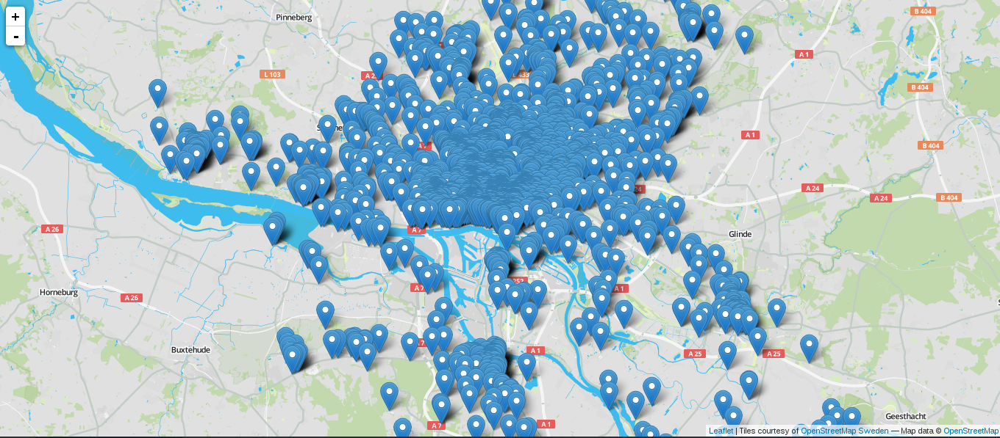
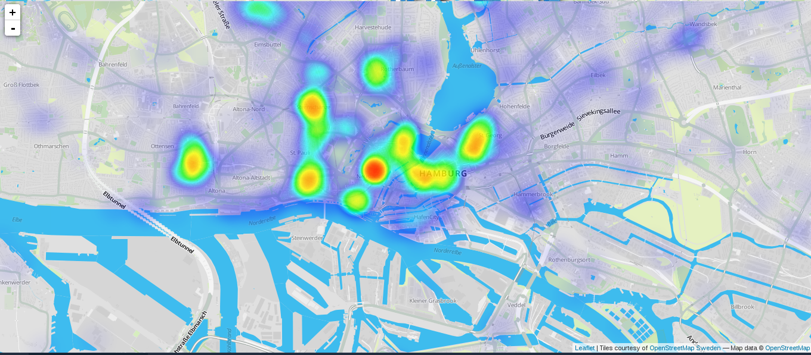

#Zoomable map with Leaflet.js

Zoomable maps, along with easier and faster data collection, is the most visible evolution brought to cartograhy by computers.

There is an excellent library for creating those, [leaflet](http://leafletjs.com/). For an explanation about why it was created see [this talk](https://www.youtube.com/watch?v=NLbyHffKQuU) by the creator [Vladimir Agafonkin](https://www.youtube.com/watch?v=NLbyHffKQuU).

The [api](http://leafletjs.com/reference.html) is straight forward and [the examples](http://leafletjs.com/examples.html) are telling enough, so this tutorial will not be about how to use leaflet. Rather we will talk about a common problem when dealing with zoomable maps: big amounts of overlay data.

##Too much overlay data

###What is overlay data?

A zoomable map is generally composed of two layers: tiles and overlay data. If you check out the [quick example](http://leafletjs.com/examples/quick-start-example.html) on the leaflet webpage, the overlay data are: the circle, the marker and the triangle. The tiles are all the rest, the London map underneath.

###How can there be too much?

The example above works fine, you can move around smoothly. But there are only three features of overlay data. Lets try with more.

Create a folder ```chapter_4_zoomable``` and two other inside it ```chapter_4_zoomable/data``` and ```chapter_4_zoomable/public```. In the ```data``` folder we will put a file with bars and restaurants in Hamburg taken from OpenStreetMap called ```places.json```. Get it [here](). There are only about 2600 features but this is enough for our example.

Go to the ```chapter_4_zoomable``` folder, initialise ```npm``` and download ```leaflet```

```
$ npm init
$ npm install leaflet --save
```

In ```chapter_4_zoomable/public```, add a ```index.html``` file like this

```
<!DOCTYPE html>
<html>
	<head>
		<meta charset="utf-8">
		<meta name="viewport" content="width=device-width, initial-scale=1.0, maximum-scale=1.0, user-scalable=no">
		<title></title>
		<link rel="stylesheet" href="css/leaflet.css" />
		<link rel="stylesheet" href="css/style.css" />
	</head>
	<body>
		<div id="map"></div>
		<script src="script.js"></script>
	</body>
</html>
```
Still in ```/public```, create a ```/css``` folder, copy ```leaflet.css``` from ```node_modules/leaflet/dist/leaflet.css``` and create ```style.css``` like this.

```
body {
    padding: 0;
    margin: 0;
}
html, body, #map {
    height: 100%;
}
```

```leaflet.css``` is the stylesheet that comes with the library and ```style.css``` makes the map full screen.

In ```chapter_4_zoomable``` we create a ```main.js``` file and compile it into ```public/script.js``` with [watchify](https://github.com/substack/watchify)

```
$ watchify main.js -o public/script.js
```

Open ```main.js``` and require ```leaflet``` and our data

```
var L = require('leaflet')
var data = require('./data/places.json')
```

Create a map centered on Hamburg and add a tile layer. I choose [Hydda by openstreetmap Sweden](http://openstreetmap.se/).There are more [here](http://leaflet-extras.github.io/leaflet-providers/preview/)

```
var map = L.map('map').setView([53.55, 9.99], 11)

L.tileLayer('http://{s}.tile.openstreetmap.se/hydda/full/{z}/{x}/{y}.png', {
	attribution: 'Tiles courtesy of <a href="http://openstreetmap.se/" target="_blank">OpenStreetMap Sweden</a> &mdash; Map data &copy; <a href="http://www.openstreetmap.org/copyright">OpenStreetMap</a>'
}).addTo(map)
```

Now add a marker for each feature in ```places.json```

```
for(i=0;i<data.features.length;i++) {
	var f = data.features[i]
	var c = f.geometry.coordinates
	L.marker([c[1],c[0]]).addTo(map)
}
```

Open ```chapter_4_zoomable/public/index.html``` in the browser.

We have the tile layer but the markers are not there. If we take a look at the console, we have

```
Error: Couldn't autodetect L.Icon.Default.imagePath, set it manually.
```

So leaflet can not find the marker icon that is in here ```node_modules/leaflet/dist/images```. Copy the folder to ```chapter_4_zoomable/public```. And set the path to it in ```main.js``` before creating the map.

```
L.Icon.Default.imagePath = 'images' // <-- new

var map = L.map('map').setView([53.55, 9.99], 11)
// ... the rest here
```

Check the browser again. 



It works but the page takes very long time to load and moving around is nearly impossible. We already have too many overlay features for the browser to handle.

###Heatmap

One way to tackle this problem is to create a heatmap. We will use some code that I found on [Vladimir Agafonkins github page](https://raw.githubusercontent.com/Leaflet/Leaflet.heat/gh-pages/dist/leaflet-heat.js)

Create a folder ```chapter_4_zoomable/lib``` and a file called ```heat.js``` in it

```
module.exports = function(L) {
	//copy - paste the above code here
}
```

Require it in ```main.js``` and add the function to ```L``` at the beginning of the document, just after the required ```leaflet```

```
var L = require('leaflet')
var heat = require('./lib/heat') // <-- new
heat(L) // <-- new
```

Modify the loop to create an array of latitudes and longitudes called ```latlngs```

```
var latlngs = []
for(i=0;i<data.features.length;i++) {
	var f = data.features[i]
	var c = f.geometry.coordinates
	latlngs.push([c[1],c[0]])
}
```

And add it to ```L.heatLayer```, enabled by the ```heat.js``` plugin we just copied

```
var heatmap = L.heatLayer(latlngs).addTo(map)
```

Try it in the browser. 



Now the map is smooth again.

This works well to see in which areas there are the most bars but we would like to see the markers at higher zoom levels, when we zoom in to an area. 

We need to just show the features in the visible part of the map. One way to do this is to divide the markers into parts, "tiles", and only show those needed.

###Divide features into "tiles"

####Zoom level and map bounds

First we will display, in the console, the zoom level and the bounds of the map after a movement (the ```moveend``` event).

```
map.on('moveend', function() {
	var zoom = map.getZoom()
	var bounds = map.getBounds()
	console.log(zoom, bounds)
})
```

If we go back to the browser, open the console and move around we see at which zoom level we are and the ```_southWest``` (the lowest longitude and latitude) point and ```_northEast``` (the highest longitude and latitude) point of the visible map.

####Remove heatmap on higher zoom levels

Say we want to display the markers at zoom levels higher or equal to 16. Then we want the heatmap to disappear on those zoom level. Add the following to the ```moveend``` event.

```
map.on('moveend', function() {
	var zoom = map.getZoom()
	var bounds = map.getBounds()
	console.log(zoom, bounds)
	if(zoom >= 16) { map.removeLayer(heatmap) } // <--new
	if(zoom < 16) { map.addLayer(heatmap) } // <-- new
})
```

####Find current tiles

Now we want to add our markers when zoom level is 16 or higher. But we need to divide the data into tiles. We could use our own tile coordinates system but there is already an existing one for maps, the one to display the raster tiles (the London map of the [leaflet example](http://leafletjs.com/examples/quick-start-example.html)).

[tilebelt](https://www.npmjs.com/package/tilebelt) is a library that, among other things, lets you convert points to tiles at a certain level. Download it

```
$ npm install tilebelt --save
```

Require the library in ```main.js```

```
var tilebelt = require('tilebelt')
```

Convert the map bounds to tiles at zoom level 16 on ```moveend``` with tilbelts ```pointToTile()``` function.

```
map.on('moveend', function() {
	var zoom = map.getZoom()
	var bounds = map.getBounds()
	if(zoom >= 16) { 
		map.removeLayer(heatmap)
// new from here 
		var minTile = tilebelt.pointToTile(bounds._southWest.lng, bounds._southWest.lat, 16)
		var maxTile = tilebelt.pointToTile(bounds._northEast.lng, bounds._northEast.lat, 16)
		console.log(minTile, maxTile)
// to here
	}
	if(zoom < 16) { map.addLayer(heatmap) }
})
```

This just tells us the tiles of the bottom-left and top-right corners. Create a function that gives us all the tiles in the map view

```
function getTiles(bounds, zoom, callback) {
	var tileMin = tilebelt.pointToTile(bounds._southWest.lng, bounds._southWest.lat, zoom)
	var tileMax = tilebelt.pointToTile(bounds._northEast.lng, bounds._northEast.lat, zoom)
	var tiles = []
	for(i=tileMin[0];i<tileMax[0] + 1;i++) {
		for(j=tileMax[1];j<tileMin[1] + 1;j++) {
			tiles.push([i,j])
		}
	}
	callback(tiles)
}
```

And call it on ```moveend``` when zoom level is higher than 16

```
map.on('moveend', function() {
	var zoom = map.getZoom()
	var bounds = map.getBounds()
	if(zoom >= 16) { 
		map.removeLayer(heatmap) 
		getTiles(bounds, 16, function(tiles) {
			console.log(tiles)
		}) // <-- new
	}
	if(zoom < 16) { map.addLayer(heatmap) }
})
```

####Divide features into tiles

So now that we know which tiles we need, we need to divide our points into tiles. I have created a script that does just that. Download it from [github](https://github.com/idris-maps/geojson-point-tiles) to your Desktop and install the dependecies

```
$ git clone https://github.com/idris-maps/geojson-point-tiles.git
$ cd geojson-point-tiles
$ npm install
```

Put ```places.json``` in the ```data``` folder, open ```run.js``` and change: 
* the path to the data
* the name
* the zoom level

```
var createTiles = require('./lib/createTiles')

var data = require('./data/places.json') //<-- the points to divide into tiles
var name = 'places' // <-- the name of the output
var zoom = 16 // <-- the zoom level of the tiles

createTiles(data, name, zoom, function() {
	console.log('done')
})
```

Run the script 

```
$ node run
```

In the ```data``` folder, we now have a file called ```places_tiles.json``` that looks like this:

```
[
	{x: <tileX>, y: <tileY>, features: [<array of geojson features>]},
	{x: <tileX>, y: <tileY>, features: [<array of geojson features>]},
	// ...
]
```

It is an array of feature collections divided into x and y coordinates.

Copy ```data/places_tiles.json``` to ```chapter_4_zoomable/data```. You can delete the ```geojson-point-tiles``` folder, we do not need it anymore.

####Using the markers divided into tiles

Go back to ```main.js``` and require this dataset instead of ```places.json```

```
var data = require('./data/places.json')
```

becomes

```
var data = require('./data/places_tiles.json')
```

We need to modify the loop that creates the ```latlngs``` array for the heatmap

```
var latlngs = []
for(i=0;i<data.features.length;i++) {
	var f = data.features[i]
	var c = f.geometry.coordinates
	latlngs.push([c[1],c[0]])
}
```
 
becomes

```
var latlngs = []
for(i=0;i<data.length;i++) {
	var tile = data[i]
	for(j=0;j<tile.features.length;j++) {
		var f = tile.features[j]
		var c = f.geometry.coordinates
		latlngs.push([c[1],c[0]])
	}
}
```

####Get the points within the map view

We know which tiles should be shown thanks to the ```getTiles()``` function we created previously. We want to get the features in said tiles so that we can display them. We will create a ```getFeatures()``` function that takes the needed tiles and returns the features within.

```
function getFeatures(tiles, data, callback) {
	var features = []
	for(i=0;i<tiles.length;i++) {
		var tile = tiles[i]
		for(j=0;j<data.length;j++) {
			var tileData = data[j]
			if(tileData.x === tile[0] && tileData.y === tile[1]) {
				for(k=0;k<tileData.features.length;k++) {
					features.push(tileData.features[k])
				}
			}
		}
	}
	callback(features)
}
```

We add this function to the callback of the ```getTiles()``` function in the ```moveend``` event

```
map.on('moveend', function() {
	var zoom = map.getZoom()
	var bounds = map.getBounds()
	if(zoom >= 16) { 
		map.removeLayer(heatmap) 
		getTiles(bounds, 16, function(tiles) {
			getFeatures(tiles, data, function(features) { // <-- new
				console.log(features) // <-- new
			}) // <-- new
		})
	}
	if(zoom < 16) { map.addLayer(heatmap) }
})
```

If we try it in the browser and look at the console we see that if we are on a zoom level of 16 or higher, the features are displayed. 

Add them to the map as markers

```
map.on('moveend', function() {
	var zoom = map.getZoom()
	var bounds = map.getBounds()
	if(zoom >= 16) { 
		map.removeLayer(heatmap) 
		getTiles(bounds, 16, function(tiles) {
			getFeatures(tiles, data, function(features) {
// new from here -->
				for(i=0;i<features.length;i++) {
					var f = features[i]
					var c = f.geometry.coordinates
					L.marker([c[1],c[0]]).addTo(map)
				}
// <-- to here 
			})
		})
	}
	if(zoom < 16) { map.addLayer(heatmap) }
})
```

Try it in the browser.

Have you noticed that the more you move, the slower it gets and the darker the shadows of the markers get? That is because every time you move, markers are added. They should be removed before we add new ones.

####Remove old markers before adding new

If you inspect the HTML (ctrl-shit-C in firefox), you see that the markers are all in a ```<div>``` element with a class of "leaflet-marker-pane" and all the shadows in a ```<div>``` with a class of "leaflet-shadow-pane". We can remove the markers by clearing those two ```<div>```s. Make a function that does it

```
function removeMarkers() {
	var markerPane = document.getElementsByClassName('leaflet-marker-pane')
	var shadowPane = document.getElementsByClassName('leaflet-shadow-pane')
	markerPane[0].innerHTML = ''
	shadowPane[0].innerHTML = ''
} 
```

And call it on ```moveend``` before the new markers are added

```
map.on('moveend', function() {
	var zoom = map.getZoom()
	var bounds = map.getBounds()
	removeMarkers() // <-- new
	if(zoom >= 16) { 
		map.removeLayer(heatmap) 
		getTiles(bounds, 16, function(tiles) {
			getFeatures(tiles, data, function(features) {
				for(i=0;i<features.length;i++) {
					var f = features[i]
					var c = f.geometry.coordinates
					L.marker([c[1],c[0]]).addTo(map)
				}
			})
		})
	}
	if(zoom < 16) { map.addLayer(heatmap) }
})
```

We now have a working map with more than 2600 points.

If we have a look at the size of our final script, ```chapter_04_zoomable/public/script.js``` it is 1.2MB. Which is rather heavy. Although it works locally, it will take some time to be sent down the wires to your users, in particular those using mobile phones. 

The size of our script is that big because it includes all the data (~1MB). In the next chapter we will create a backend for our app. That is a server that sends data only when needed.
